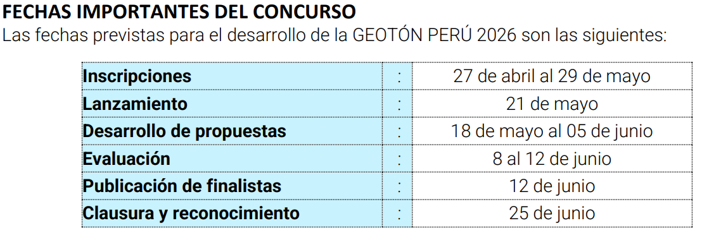
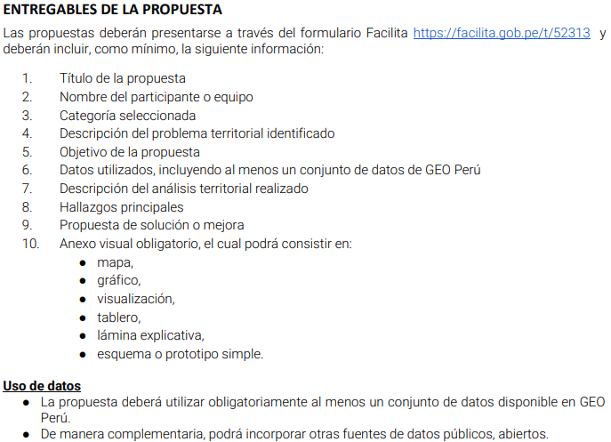

# Geoton UNSA 2026
- Este es el repositorio para almacenar la organizar la data extraida y los avances hechos con esta
- Link a las bases: https://cdn.www.gob.pe/uploads/document/file/10012970/8165845-bases-geoton.pdf?v=1779321077
- Cosas importantes:

